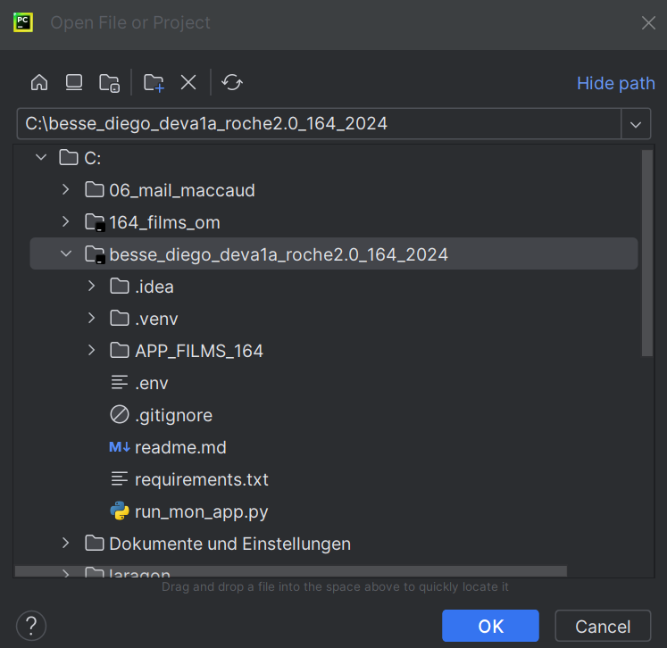

# Module 164 2024.03.26
### Marche à suivre pour le bon fonctionnement de la base de données :

Cette documentation va vous apprendre à utiliser ma base de données via une application FLASK.

### Préréquis :

Les éléments suivants seront nécéssaires pour faire fonctionner le projet :

#### 1. Un serveur MySQL .
   - Installer Laragon-Full => https://laragon.org/download/ 
   - LARAGON (heidi.sql) ou XAMPP ou UWAMP
   - Pour les MAC : MAMP ou https://www.codeur.com/tuto/creation-de-site-internet/version-mysql/

#### 2. Python 
   - https://www.python.org/downloads/

   - ⚠️ Cocher la case pour que le “PATH” intègre le programme Python

   - Une fois la “case” du PATH cochée, il faut choisir d’installer

   - Un peu avant la fin du processus d’installation, cliquer sur “disabled length limit” et cliquer sur “CLOSE”

   - Le test de Python se fait après avec le programme “PyCharm"

#### 3. Git
   - https://gitforwindows.org/

   - Test “GIT” => se fait dans le programme “PyCharm” (on en reviendra plus tard)

#### 4. PyCharm

   - “PyCharm” (community) doit être installé, car toutes mes démonstrations sont faites avec cette version de l’IDE. Vous pouvez télécharger tous les produits de JetBrains car vous êtes étudiant.
     - https://www.jetbrains.com/fr-fr/community/education/#students (Votre carte d’apprenti suffit pour avoir accès aux outils pro)

   - Lors de l’installation, il faut cocher toutes les options ASSOCIATIONS, ADD PATH, etc
   - Ouvrir “PyCharm” pour la première fois pour le configurer. Choisir le bouton “New Project”
   - Changer le répertoire pour ce nouveau projet, il faut créer un nouveau répertoire “vide” sur votre disque en local.
   - Il est important d’avoir sélectionné le répertoire que vous venez de créer car “PyCharm” va automatiquement créer un environnement virtuel (.venv) dans ce répertoire.
   - Menu : File->Settings->Editor->General->Auto Import (rubrique Python) cocher “Show auto-import tooltip”.
     - PyCharm vient d’ouvrir une fenêtre avec le contenu du “main.py” pour configurer les actions “UNDO” et “REDO”
     - Sélectionner tout le texte avec un CTRL + A
     - puis couper avec un CTRL + X 
     - puis CTL + Z (UNDO) suivi d'un CTRL + Y (REDO)
     - PyCharm va vous demander de choisir l’action du CTRL + Y pour faire un REDO. Le CTRL + Y représente l’action REDO, mais pas chez JetBrains.
     
### Marche à suivre :

#### 1. Télécharger "Roche2.0"
Dans un terminal de commande windows, copier les lignes suivantes et les coller dans le terminal :

    cd C:\
    git clone https://github.com/diego3223/besse_diego_deva1a_roche2.0_164_2024.git besse_diego_deva1a_roche2.0_164_2024
    cd besse_diego_deva1a_roche2.0_164_2024
    rmdir /S/Q .git
    python -m venv .venv
    cd "C:\besse_diego_deva1a_roche2.0_164_2024\.venv\Scripts"
    activate
    cd C:\besse_diego_deva1a_roche2.0_164_2024
    python -m pip install --upgrade pip
    pip install -r requirements.txt
    echo Vos commandes ont été exécutées.
    REM -- Pause jusqu'à ce qu'une touche soit pressée, puis ferme la fenêtre --
    pause
    exit

#### 2. Ouvrir le projet avec PyCharm :
   - Ouvrir PyCharm, Menu « File » => « Open project »  
     Observer la structure du répértoire "besse_diego_deva1a_roche2.0_164_2024", il faut que le répértoire ".venv" soit présent.

#### 3. Démarrer "Roche2.0"
   - Démarrer le serveur MySql (Laragon ou autres cités au début...)
   - Dans PyCharm, importer la base de données à partir du dump
     - Ouvrir le fichier APP_FILMS_164/database/1_ImportationDumpSql.py
     - Cliquer avec le bouton droit sur l’onglet de ce fichier et choisir “run” (CTRL-MAJ-F10)
     - En cas d’erreurs : ouvrir le fichier .env à la racine du projet, contrôler les indications de connexion pour la bd.
   - Test simple de la connexion à la BD
     - Ouvrir le fichier APP_FILMS_164/database/2_test_connection_bd.py
     - Cliquer avec le bouton droit sur l’onglet de ce fichier et choisir “run” (CTRL-MAJ-F10)
   - Démarrer le microframework FLASK
     - Dans le répertoire racine du projet, ouvrir le fichier run_mon_app.py
     - Cliquer avec le bouton droit sur l’onglet de ce fichier et choisir “run” (CTRL-MAJ-F10)
     - Ensuite, cliquer sur le lien avec des numéros de couleur rouge.

Le "début de la fin"

Le mode d'emploi et vos devoirs se trouvent à l'adresse suivante.

https://info164.github.io/doc164ver1/index.html